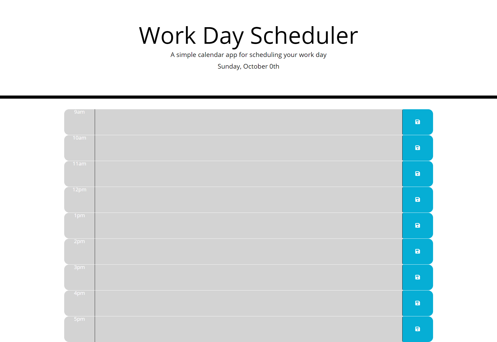

# homework05_jquery_day_planner

# 05 Third-Party APIs: Work Day Scheduler

Create a simple calendar application that allows the user to save events for each hour of the day. This app will run in the browser and feature dynamically updated HTML and CSS powered by jQuery.

## Description

The calendar was created 

## Installation

## Usage

## Technologies Used

GitHub / VSCode / Study Group / Tutors / TA's

## Problems I faced

I had issues with getting the questions to move on to the next
Issues with the time not stopping once the quiz ended
All have been fixed

## Credits

## Image

## Links
[link to GitHub!](https://github.com/ryanwit/homework04_code_quiz)

[link to Webpage!](https://ryanwit.github.io/homework04_code_quiz//)

# License